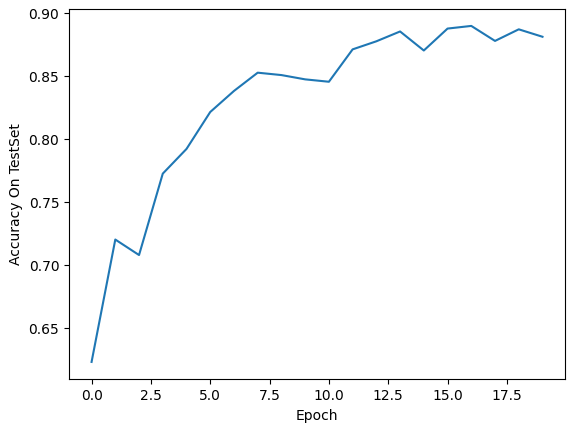
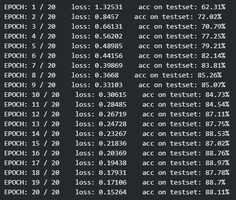
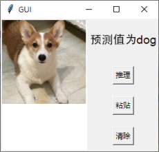

# ResNet-18-CIFAR-10-Demo
A ResNet 18 Demo Based on Torch and CIFAR-10 Dataset

`ResNet.ipynb` is a ResNet simple demo. It includes dataset loading, data preprocessing, model construction, model training, model inference, and final result output.

The neural network accuracy in the test set can reach over 88%.

`gui.ipynb` is a GUI program used to display the performance of a model when faced with real image input.

`model.pth` is a pre trained network parameter file.

---

#### Accuracy On TestSet

---

#### Loss and accuracy of each EPOCH

---

#### GUI interface

